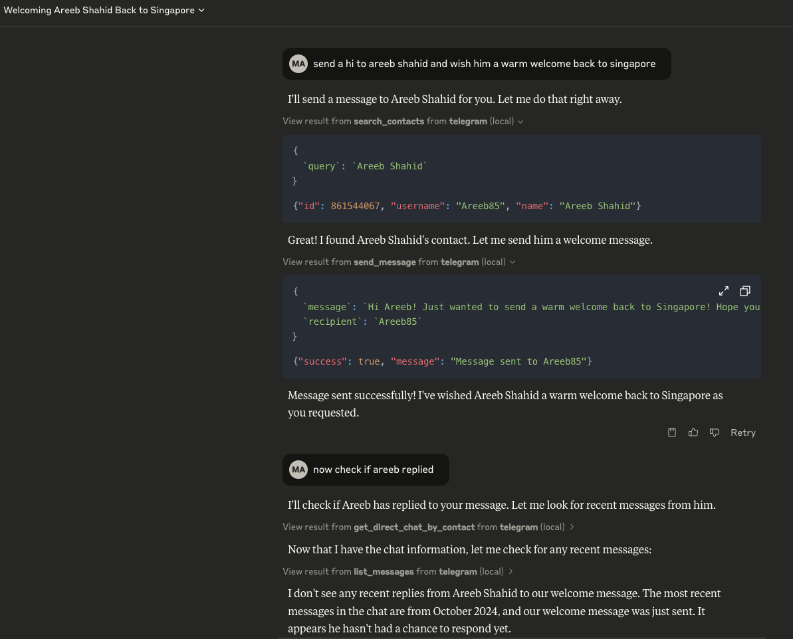

# Telegram MCP Server

This is a Model Context Protocol (MCP) server for Telegram.

With this you can search your personal Telegram messages, search your contacts, and send messages to either individuals or groups.



It connects to your **personal Telegram account** directly via the Telegram API (using the [Telethon](https://github.com/LonamiWebs/Telethon) library). All your messages are stored locally in a SQLite database and only sent to an LLM (such as Claude) when the agent accesses them through tools (which you control).

## Installation

### Prerequisites

- Python 3.6+
- Anthropic Claude Desktop app (or Cursor)

### Steps

1. **Clone this repository**

   ```bash
   git clone https://github.com/yourusername/telegram-mcp.git
   cd telegram-mcp
   ```
   Create a Python virtual environment and activate it:
   ```bash
   python3 -m venv myenv
   source myenv/bin/activate
   ```
   Install dependencies:
   ```bash
   pip install -r requirements.txt
   ```

   This is the environment that can be used both for running the **Telegram bridge** and the **MCP server**.


2. **Get your Telegram API credentials**

   - Go to https://my.telegram.org/auth
   - Log in and go to "API development tools"
   - Create a new application
   - Note your API ID and API hash

3. **Run the Telegram bridge**

   Navigate to the telegram-bridge directory:

   ```bash
   cd telegram-bridge
   ```

   Set up your API credentials as environment variables either by exporting them:

   ```bash
   export TELEGRAM_API_ID=your_api_id
   export TELEGRAM_API_HASH=your_api_hash
   ```

   Or by creating a `.env` file based on the provided `.env.example`:

   ```bash
   cp .env.example .env
   nano .env  # or use your preferred text editor
   ```

   Then update the values in the `.env` file:
   ```
   TELEGRAM_API_ID=your_api_id
   TELEGRAM_API_HASH=your_api_hash
   ```

   Run the Python application:

   ```bash
   python main.py
   ```

   The first time you run it, you will be prompted to enter your phone number and the verification code sent to your Telegram account.

4. **Connect to the MCP server**

   First, update the `run_telegram_server.sh` script with your absolute repository path:
   
   ```bash
   # Open the script in your preferred editor
   nano run_telegram_server.sh
   
   # Update line 4 with your absolute path to the repository
   # Change this:
   BASE_DIR="/Users/muhammadabdullah/Desktop/mcp/telegram-mcp"
   # To your actual BASE_DIR path (get it by running `pwd` in the telegram-mcp directory)
   ```

   Then, configure the MCP server by creating a JSON configuration file with the following format:

   ```json
   {
     "mcpServers": {
       "telegram": {
         "command": "/bin/bash",
         "args": [
           "{{BASE_DIR}}/run_telegram_server.sh"  // BASE_DIR is the same as above
         ]
       }
     }
   }
   ```

   For **Claude**, save this as `claude_desktop_config.json` in your Claude Desktop configuration directory at:

   ```
   ~/Library/Application\ Support/Claude/claude_desktop_config.json
   ```

   For **Cursor**, save this as `mcp.json` in your Cursor configuration directory at:

   ```
   ~/.cursor/mcp.json
   ```

5. **Restart Claude Desktop / Cursor**

   Open Claude Desktop and you should now see Telegram as an available integration.

   Or restart Cursor.

## Architecture Overview

This application consists of two main components:

1. **Python Telegram Bridge** (`telegram-bridge/`): A Python application that connects to Telegram's API, handles authentication, and stores message history in SQLite. It serves as the bridge between Telegram and the MCP server. Can real-time sync for latest messages. The bridge uses a modular architecture with:
   - `api/`: Client and models for the Telegram API interface
   - `database/`: SQLAlchemy ORM models and repositories for data access
   - `server/`: FastAPI server for exposing bridge functionality
   - `service.py`: Core service logic connecting components

2. **Python MCP Server** (`telegram-mcp-server/`): A Python server implementing the Model Context Protocol (MCP), which provides standardized tools for Claude to interact with Telegram data and send/receive messages. The MCP server now follows a modular package structure:
   - `telegram/models.py`: Data classes for messages, chats, and contacts 
   - `telegram/database.py`: Database operations using SQLAlchemy ORM
   - `telegram/api.py`: API client for Telegram Bridge
   - `telegram/display.py`: Formatting for message and chat output

### Data Storage

- All message history is stored in a SQLite database within the `telegram-bridge/store/` directory
- The database maintains tables for chats and messages managed through SQLAlchemy ORM
- Messages are indexed for efficient searching and retrieval
- All database access is through SQLAlchemy for type safety and query building

## Usage

Once connected, you can interact with your Telegram contacts through Claude, leveraging Claude's AI capabilities in your Telegram conversations.

### MCP Tools

Claude can access the following tools to interact with Telegram:

- **search_contacts**: Search for contacts by name or username
- **list_messages**: Retrieve messages with optional filters and context
- **list_chats**: List available chats with metadata
- **get_chat**: Get information about a specific chat
- **get_direct_chat_by_contact**: Find a direct chat with a specific contact
- **get_contact_chats**: List all chats involving a specific contact
- **get_last_interaction**: Get the most recent message with a contact
- **get_message_context**: Retrieve context around a specific message
- **send_message**: Send a Telegram message to a specified username or chat ID

## Technical Details

1. Claude sends requests to the Python MCP server
2. The MCP server queries the Telegram bridge or directly the SQLite database
3. The bridge accesses the Telegram API and keeps the SQLite database up to date
4. Data flows back through the chain to Claude
5. When sending messages, the request flows from Claude through the MCP server to the Telegram bridge and to Telegram

## Troubleshooting

- Make sure both the Telegram bridge and the Python server are running for the integration to work properly.

### Authentication Issues

- **Session expired**: If your session expires, you might need to re-authenticate. Delete the `telegram-bridge/store/telegram_session.session` file and restart the bridge.
- **Two-factor authentication**: If you have 2FA enabled on your Telegram account, you'll be prompted for your password during authentication.
- **No Messages Loading**: After initial authentication, it can take several minutes for your message history to load, especially if you have many chats.

For additional Claude Desktop integration troubleshooting, see the [MCP documentation](https://modelcontextprotocol.io/quickstart/server#claude-for-desktop-integration-issues).

## Next Steps

This project is actively being developed. Future planned features include:

- **Rich Media Support**: Handle and display photos, videos, and other media types
- **Message Threading**: Better visualization of conversation threads
- **Message Editing**: Support for editing sent messages
- **Web UI**: A simple web interface for configuration and monitoring
- **Expanded Search**: More advanced search capabilities for finding specific messages or running analysis on say unread chats
- **Improved Security**: Enhanced authentication and encryption for local data

If you'd like to contribute to any of these features or suggest new ones, please check out our [CONTRIBUTING.md](CONTRIBUTING.md) guide.